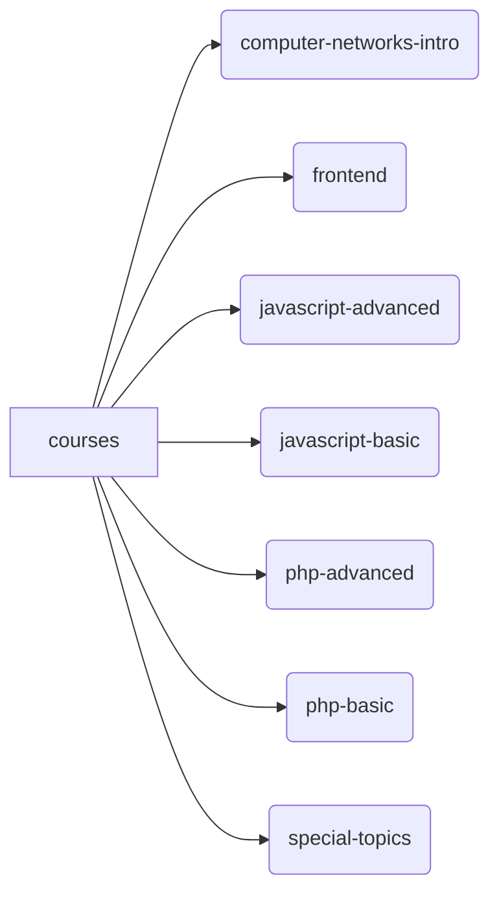

# courses - prof. felipe alencar
A repository for saving textbooks, slides, and codes of my lectures @ IFAL - Campus Arapiraca

The repository is branch-based, so, for example, if you want using sources from the PHP Basics course, you need to switch to that branch:
https://github.com/felipealencar/courses/tree/php-basic

# gitpod support
Each branch has its .gp directory with Dockerfile environment definition considering the programming language and libraries used in the branch-related course.

# structure

# students and contributors
[@Manuel-Antunes](https://github.com/Manuel-Antunes)
