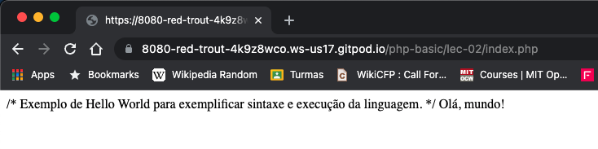

Repositório com os códigos-fonte utilizados nas aulas do curso de PHP Básico ministrado originalmente no Instituto Federal de Alagoas (IFAL) - Campus Arapiraca.

## Instruções:
Para executar os códigos das aulas mais facilmente, utilize a extensão gitpod em seu navegador Chrome. Com a extensão instalada, basta clicar no botão gitpod que um ambiente Apache+PHP+MySQL será configurado para você.

### Executando os códigos:
Na raiz do repositório, execute o comando:

```
php -S localhost:8080
```

Permita que o Gitpod abra uma janela de navegador, e no endereço digite o caminho para a aula desejada. Por exemplo, acessando a aula 02:

```
https://8080-red-trout-4k9z8wco.ws-us17.gitpod.io/php-basic/lec-02/index.php
```

### Para implementações que precisem do banco de dados:
<b>Anteção:</b>Por algum motivo, o arquivo ```mysql-bashrc-launch.sh``` está causando um erro ao ser executado automaticamente pelo ambiente do Gitpod. Atualmente, para resolver o problema, é preciso executar o .sh de forma manual via terminal.




# Conteúdo
Aula 02 - Hello World com PHP | Slides

Aula 03 - Laços de Repetição e Comandos Condicionais | Slides

Aula 04 - Formulário HTML e PHP | Slides

Aula 05 - PHP e Conexão com Banco de Dados | Slides

Aula 06 - PHP e PDO | Slides

Aula 07 - Autoload e Orientação a Objetos | Slides

Aula 10 - PHP com MVC | Slides

Aula 13 - Introdução Laravel | Slides

Aula 14 - API em PHP | Slides

Aula 17 - SOAP com PHP | Slides

Aula 18 - Introdução Laravel | Slides

